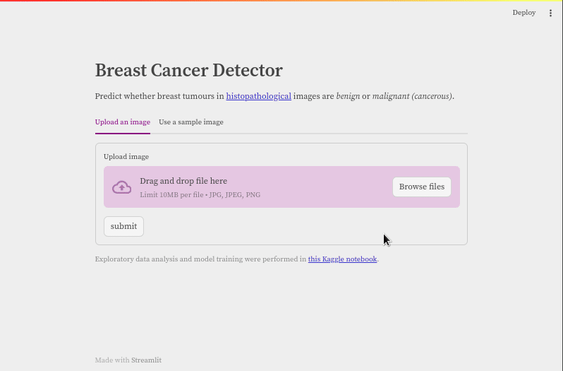

# Breast Cancer Detector

Predict whether breast tumours in [histopathological][hp] images are *benign* or *malignant (cancerous)*.

<https://breast-cancer-kagglex-project.streamlit.app/>



Exploratory data analysis and model training were performed in [this Kaggle notebook][nb]. This project is part of my submission as a mentee in cohort 2 of the [KaggleX BIPOC Mentorship Program][kaggle-x].

[hp]: https://en.wikipedia.org/wiki/Histopathology
[nb]: https://www.kaggle.com/code/timothyabwao/detecting-breast-cancer-with-computer-vision
[kaggle-x]: https://www.kaggle.com/kagglex

## Running locally

1. Fetch the code:

    ```bash
    git clone https://github.com/Tim-Abwao/detecting-breast-cancer.git
    cd detecting-breast-cancer
    ```

2. Create a virtual environment, and install dependencies:

   >**NOTE:** Requires *python3.10* and above.

    ```bash
    python3 -m venv venv
    source venv/bin/activate
    pip install -r requirements.txt
    ```

3. Launch the app:

    ```bash
    streamlit run streamlit_app.py
    ```
